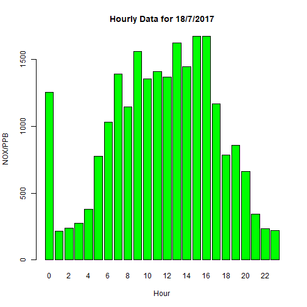

Oxides of Nitrogen (ppb) London Westminster 2017
========================================================
title: Oxides of Nitrogen (ppb) London Westminster 2017
author: Anthony Macey 
date: 21/1/2018
autosize: true

About the data
========================================================

The data shows a summary of air quality from the London Air Quality Network (LAQN), and pollution for 3 Westminster sites (Oxford Street, Covent Garden & Marylebone Road).

The datasets used in application are sourced from this repoisory airdata.csv is a raw dataset from the [LAQN](http://www.londonair.org.uk) and airdata.rds is a summary used in the bar plots.

The original dataset can be obtained from  [LAQN](http://www.londonair.org.uk/london/asp/dataspecies.asp?site1=WM6&site2=&site3=WM5&site4=&site5=MY1&site6=&day1=1&month1=jan&year1=2017&day2=31&month2=dec&year2=2017&period=15min&species=NOX&ratidate=&res=6&Submit=Replot+graph) but please respect their bandwidth.

However the data is available from the my assignment github page [here](https://github.com/anthonymacey/dp/tree/master/dpwk4) as [airdata.csv](https://raw.githubusercontent.com/anthonymacey/dp/master/dpwk4/airdata.csv) and the summary data as [airdata.rds](https://raw.githubusercontent.com/anthonymacey/dp/master/dpwk4/airdata.rds) which has been pre-processed with [process.r](https://github.com/anthonymacey/dp/blob/master/dpwk4/process.R) to make the shiny app more responsive.

Oxides of Nitrogen (ppb) Summary
========================================================


```
     month             day             hour          value       
 Min.   : 1.000   Min.   : 1.00   Min.   : 0.0   Min.   :  66.8  
 1st Qu.: 4.000   1st Qu.: 8.00   1st Qu.: 6.0   1st Qu.: 589.7  
 Median : 7.000   Median :16.00   Median :12.0   Median :1002.3  
 Mean   : 6.511   Mean   :15.68   Mean   :11.5   Mean   :1130.4  
 3rd Qu.: 9.500   3rd Qu.:23.00   3rd Qu.:17.5   3rd Qu.:1580.5  
 Max.   :12.000   Max.   :31.00   Max.   :23.0   Max.   :4131.3  
```

Oxides of Nitrogen (ppb) Server Code
========================================================


```r
library(reshape)
# Get only one day of data to display
daymonth <- cast(airdata.nox[which(airdata.nox$month == 7 &
                                 airdata.nox$day == 18), ], day ~ hour)
## Turn the daily data into an matrix
daymonth$day <- NULL
daymonth <- as.matrix(daymonth)
```


Conclusion
========================================================

The middle of the day seems to be consistantly more hazardous for Oxides of Nitrogen (ppb) however explore the dataset yourself with the [shiny app](https://swiss.shinyapps.io/dpwk4/).  This is an example from the 18/7/2017


